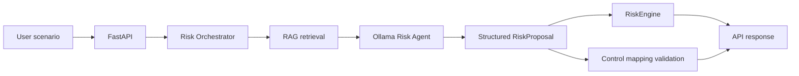

# GRC Risk Assessment Agent

Local-first **Governance, Risk, and Compliance (GRC)** risk assessment service.

Describe a security scenario in plain language. The API returns a structured risk proposal (assets, threats, vulnerabilities, risks), a **deterministic** inherent risk score and rating, and optionally **validated** control mappings from an internal control catalog.

**Core design rule:** the LLM may propose likelihood, impact, and narrative — it does **not** own `risk_score` or `risk_rating`. Those are computed only by the Python `RiskEngine` as `likelihood × impact` on a fixed 5×5 matrix.

## Problem it solves

Security and GRC teams often need a fast first-pass risk assessment from an unstructured scenario (for example: “a cloud admin has excessive permissions”). Spreadsheets and ad-hoc notes do not enforce consistent scoring, and raw LLM answers invent scores and control IDs.

This project demonstrates a safer pattern:

- Use a local LLM for structured identification and rationale
- Keep scoring in deterministic code
- Treat retrieved knowledge and LLM control IDs as **advisory** until validated against an authoritative catalog and retrieved candidates

## Why this is a GRC / security project

It implements a small but realistic GRC assessment loop:

| Concern | How this project handles it |
| --- | --- |
| Risk identification | Structured proposal from mock or Ollama agent |
| Inherent risk scoring | `RiskEngine` (not the LLM) |
| Control awareness | Internal GRC Control Catalog (`CTRL-*`) |
| Control mapping trust | Catalog + RAG-candidate validation |
| Local / private inference | Optional Ollama (`llama3.1:8b`, `nomic-embed-text`) — no cloud LLM API required |

This is a **portfolio / learning / local prototype**, not a complete GRC platform.

## Architecture



End-to-end flow for `POST /risk-assessments`:

1. **FastAPI** accepts a free-text scenario.
2. **Risk Orchestrator** optionally retrieves RAG context (when Ollama + RAG are enabled).
3. **Risk Agent** (`MockRiskAgent` or `OllamaRiskAgent`) returns a Pydantic-validated `RiskProposal`.
4. **RiskEngine** scores each proposed risk: `risk_score = likelihood × impact`, then maps the score to a rating band.
5. **Control mapping** accepts only control IDs that appear in both the authoritative catalog and the retrieved RAG context; names always come from the catalog.
6. The API returns proposal, scored risks, primary score/rating, rationale, and `mapped_controls`.

Package layout (`src/grc_agent/`):

| Package | Role |
| --- | --- |
| `api/` | FastAPI app, routes, schemas, persistence service |
| `orchestrator/` | Scenario → retrieve → propose → score → map controls |
| `agents/` | `RiskAgent` interface, mock and Ollama implementations |
| `engine/` | Deterministic 5×5 risk matrix and `RiskEngine` |
| `rag/` | Chunking, embeddings, in-memory store, retrieval |
| `controls/` | Catalog load + control ID validation |
| `llm/` | Local Ollama HTTP client |
| `db/` | SQLite / SQLAlchemy persistence for CRUD assessments |
| `models/` | Domain enums and entities |
| `config.py` | Environment-based settings |

## RAG pipeline

RAG is **optional** and runs only when **both** are true:

- `GRC_RISK_AGENT=ollama`
- `GRC_RAG_ENABLED=true`

Pipeline:

1. At startup, markdown under `data/knowledge/` is ingested (non-recursive `*.md`).
2. `access_control.md` uses general text chunking.
3. `controls.md` uses control-aware chunking so each `CTRL-*` section stays atomic when possible.
4. Embeddings use local Ollama **`nomic-embed-text`** (or a fake embedder in tests).
5. Vectors are stored in an **in-memory** cosine-similarity store (no FAISS/Chroma dependency).
6. On each assessment, the orchestrator retrieves the top **5** chunks (`DEFAULT_TOP_K`) and formats them as advisory context for the LLM.
7. Candidate control IDs are extracted from that formatted context for mapping validation.

Manual diagnostics (not used by the API):

```bash
python -m grc_agent.rag.debug_retrieve_knowledge --query "your scenario"
```

## Ollama / llama3.1:8b

When `GRC_RISK_AGENT=ollama`:

- Chat model default: **`llama3.1:8b`** via `POST {OLLAMA_HOST}/api/chat`
- Embedding model default: **`nomic-embed-text`**
- Host default: `http://127.0.0.1:11434`
- Chat timeout default: **180** seconds

There is **no** OpenAI / Anthropic / LangChain / LangGraph dependency. Inference stays on your machine when Ollama is installed and the models are pulled.

Default agent is **`mock`** so tests and local API use need no LLM.

## Risk assessment flow

```text
POST /risk-assessments  { "scenario": "..." }
        │
        ▼
RiskOrchestrator.assess(scenario)
        │
        ├─(optional) Retriever.retrieve → format_hits → context
        ├─ RiskAgent.propose(scenario, context) → RiskProposal
        ├─ RiskEngine.calculate_inherent_risk(likelihood, impact) per risk
        └─ resolve_mapped_controls(selected_control_ids, candidates, catalog)
        │
        ▼
RiskAssessmentResponse
```

`RiskProposal` forbids `risk_score` / `risk_rating` (`extra="forbid"`). Callers also cannot inject those fields on the request.

## RiskEngine and deterministic scoring

`RiskEngine` is the only component allowed to compute inherent risk:

- Inputs: integer **likelihood** and **impact** on a **1–5** scale
- Score: **`likelihood × impact`** (range 1–25)
- Rating bands (inclusive):

| Score | Rating |
| ---: | --- |
| 1–4 | `low` |
| 5–9 | `medium` |
| 10–16 | `high` |
| 17–25 | `critical` |

Example: likelihood `4`, impact `5` → score `20` → `critical`.

## Control catalog

Authoritative source: [`data/knowledge/controls.md`](data/knowledge/controls.md) (Internal GRC Control Catalog).

Examples:

- `CTRL-AC-001` — Enforce Least Privilege Access
- `CTRL-AC-002` — Require Multi-Factor Authentication
- `CTRL-CLD-001` — Block Public Access to Cloud Storage
- `CTRL-CLD-002` — Review Cloud IAM Configurations
- … (10 controls total in the current catalog)

Catalog metadata (ID + name, and related fields in the markdown) is loaded by Python. The LLM is **not** the source of truth for control names.

## Control mapping and validation

When the agent returns `selected_control_ids`, the app validates each ID:

1. Must exist in the **authoritative catalog**
2. Must appear in **retrieved RAG candidate IDs** (from the formatted context)
3. Display **name** always comes from the catalog

Invalid, invented, or non-retrieved IDs are dropped. The assessment still succeeds; `mapped_controls` may be empty.

## FastAPI API

Main orchestrated endpoint:

| Method | Path | Description |
| --- | --- | --- |
| `POST` | `/risk-assessments` | Free-text scenario → agent + RiskEngine + optional mapping (**not persisted**) |

CRUD assessment graph (SQLite-backed):

| Method | Path | Description |
| --- | --- | --- |
| `POST` | `/assessments` | Create assessment (optional nested children) |
| `GET` | `/assessments` | List assessments |
| `GET` | `/assessments/{assessment_id}` | Get assessment graph |
| `POST` | `/assessments/{assessment_id}/assets` | Add asset |
| `POST` | `/assessments/{assessment_id}/threats` | Add threat |
| `POST` | `/assessments/{assessment_id}/vulnerabilities` | Add vulnerability |
| `POST` | `/assessments/{assessment_id}/controls` | Add control |
| `POST` | `/assessments/{assessment_id}/risks` | Add risk (**scored by RiskEngine**) |
| `GET` | `/assessments/{assessment_id}/risks` | List risks |

Unknown IDs → **404**. Invalid bodies / out-of-range scales / forbidden score fields → **422**.

### Swagger / OpenAPI

With the API running, open:

- Interactive docs: [http://127.0.0.1:8000/docs](http://127.0.0.1:8000/docs)
- OpenAPI JSON: [http://127.0.0.1:8000/openapi.json](http://127.0.0.1:8000/openapi.json)

Use **Try it out** on `POST /risk-assessments` to exercise the orchestrator.

## Configuration

| Variable | Default | Meaning |
| --- | --- | --- |
| `GRC_DATABASE_URL` | `sqlite:///data/grc_agent.db` | SQLite URL |
| `GRC_RISK_AGENT` | `mock` | `mock` or `ollama` |
| `OLLAMA_HOST` | `http://127.0.0.1:11434` | Ollama base URL |
| `OLLAMA_MODEL` | `llama3.1:8b` | Chat model |
| `OLLAMA_EMBED_MODEL` | `nomic-embed-text` | Embedding model |
| `OLLAMA_TIMEOUT_SECONDS` | `180` | Chat HTTP timeout |
| `GRC_RAG_ENABLED` | `false` | Enable RAG ingest/retrieve (requires `ollama`) |
| `GRC_RAG_DEBUG` | `false` | Print/log retrieved context before propose |

Copy [`.env.example`](.env.example) to `.env` for local overrides. **Do not commit `.env`.**

## How to run locally

Requirements:

- Python **3.11+**
- Optional: [Ollama](https://ollama.com/) with `llama3.1:8b` and `nomic-embed-text` for the LLM/RAG path

```bash
python -m venv .venv

# Windows
.venv\Scripts\activate

# macOS / Linux
# source .venv/bin/activate

pip install -e ".[dev]"
```

### Mock agent (default — no Ollama)

```bash
uvicorn grc_agent.api.app:create_app --factory --reload
```

### Ollama without RAG

```bash
# Windows PowerShell
$env:GRC_RISK_AGENT="ollama"
uvicorn grc_agent.api.app:create_app --factory --reload
```

```bash
# macOS / Linux
GRC_RISK_AGENT=ollama uvicorn grc_agent.api.app:create_app --factory --reload
```

### Ollama with RAG

```bash
# Windows PowerShell
$env:GRC_RISK_AGENT="ollama"
$env:GRC_RAG_ENABLED="true"
uvicorn grc_agent.api.app:create_app --factory --reload
```

```bash
# macOS / Linux
GRC_RISK_AGENT=ollama GRC_RAG_ENABLED=true uvicorn grc_agent.api.app:create_app --factory --reload
```

Then open [http://127.0.0.1:8000/docs](http://127.0.0.1:8000/docs).

## How to run tests

```bash
pytest
```

Most tests use `MockRiskAgent` and/or a fake embedder. A small number of optional live-Ollama checks skip automatically when Ollama is unreachable.

## Testing

The suite currently includes **213** tests covering:

- RiskEngine matrix and scale validation
- Orchestrator scoring ownership
- Ollama agent schema validation (HTTP mocked)
- RAG chunking, ingest, retrieval wiring, and `top_k` defaults
- Control catalog parsing and mapping validation rules
- FastAPI CRUD and `POST /risk-assessments` behavior

```bash
pytest
```

## Example scenario and response

Request (mock agent — deterministic, no LLM):

```bash
curl -X POST http://127.0.0.1:8000/risk-assessments ^
  -H "Content-Type: application/json" ^
  -d "{\"scenario\": \"A public patient portal stores PHI. Patients log in with password only; MFA is off.\"}"
```

Illustrative response shape (mock agent; fields abbreviated):

```json
{
  "scenario": "A public patient portal stores PHI. Patients log in with password only; MFA is off.",
  "proposal": {
    "assets": [
      {
        "id": "asset-1",
        "name": "In-scope business application",
        "criticality": "high"
      }
    ],
    "threats": [
      {
        "id": "threat-1",
        "name": "Unauthorized access",
        "category": "unauthorized_access",
        "asset_ids": ["asset-1"]
      }
    ],
    "vulnerabilities": [
      {
        "id": "vuln-1",
        "name": "Insufficient access control",
        "severity": "high",
        "asset_ids": ["asset-1"]
      }
    ],
    "risks": [
      {
        "id": "risk-1",
        "title": "Unauthorized access to sensitive information",
        "likelihood": 4,
        "impact": 5,
        "rationale": "Deterministic mock proposal (not an LLM). Scenario excerpt: …",
        "asset_ids": ["asset-1"],
        "threat_ids": ["threat-1"],
        "vulnerability_ids": ["vuln-1"]
      }
    ],
    "selected_control_ids": []
  },
  "scored_risks": [
    {
      "id": "risk-1",
      "title": "Unauthorized access to sensitive information",
      "likelihood": 4,
      "impact": 5,
      "risk_score": 20,
      "risk_rating": "critical",
      "rationale": "…"
    }
  ],
  "risk_score": 20,
  "risk_rating": "critical",
  "rationale": "…",
  "mapped_controls": []
}
```

With Ollama + RAG enabled, `proposal.selected_control_ids` may include candidate IDs, and `mapped_controls` contains only IDs that pass catalog + retrieval validation (for example `CTRL-CLD-001` with its catalog name).

## Technical design decisions

### Why RAG is used

Retrieved markdown provides grounded GRC context (access-control guidance and catalog entries) so the LLM can select relevant `CTRL-*` IDs from material that actually exists in the knowledge base, instead of inventing controls from parametric memory alone.

### Why structured Pydantic output is used

`RiskProposal` enforces required relationships, scale bounds, and `extra="forbid"` so the API never accepts LLM-supplied `risk_score` / `risk_rating`. Invalid JSON shapes fail validation before scoring.

### Why RiskEngine is separate from the LLM

Scoring must be reproducible, auditable, and independent of model drift. The LLM proposes likelihood/impact; Python alone computes score and rating. That boundary is intentional for GRC credibility.

### Why control IDs are validated against the catalog and retrieved candidates

Two gates reduce hallucinated mappings:

1. **Catalog** — ID must exist in `controls.md`
2. **Retrieved candidates** — ID must appear in the RAG context for this scenario

An ID known to the catalog but not retrieved for the scenario is still rejected.

### Why the LLM is not treated as authoritative for control names

Names and control metadata come from the catalog parser. The API response `mapped_controls[].name` is never taken from free-form LLM text.

## Security considerations

- **LLM output is untrusted.** It is schema-validated and then filtered; it is never the final authority for scores or control names.
- **Control IDs are validated** against both the catalog and retrieved candidates before appearing in `mapped_controls`.
- **Secrets must not be committed.** Use `.env` locally; only `.env.example` (non-secret names/values) belongs in Git. This project does not require cloud API keys for its default local path.
- **Risk scoring is deterministic after the LLM proposal.** Changing the model should not silently redefine the 5×5 matrix.
- **RAG context is advisory**, not authoritative. Retrieval improves prompting; validation and the RiskEngine still own compliance-critical outputs.

## Limitations / Future work

**Not implemented yet** (do not assume these exist):

- Automated control effectiveness testing
- Evidence collection / document upload analysis
- Live cloud security posture checks (AWS/Azure/GCP APIs)
- Continuous monitoring or alerting pipelines
- Automated remediation / ticket creation
- Production-grade observability (metrics, tracing, structured audit trails)
- Multi-framework mapping UI (ISO 27001 / NIST CSF / CIS as first-class products)
- Authentication / multi-tenant authorization for the API
- Persistent vector database (current store is in-process memory)
- Web dashboard / report PDF generation

Possible roadmap directions: richer catalogs, evaluation harnesses for Ollama proposals, optional Docker packaging, and stronger retrieval quality for control selection — without moving scoring or catalog authority into the LLM.

## Requirements

- Python 3.11+
- Optional: Ollama + `llama3.1:8b` + `nomic-embed-text`

## License

MIT. See [LICENSE](LICENSE).
