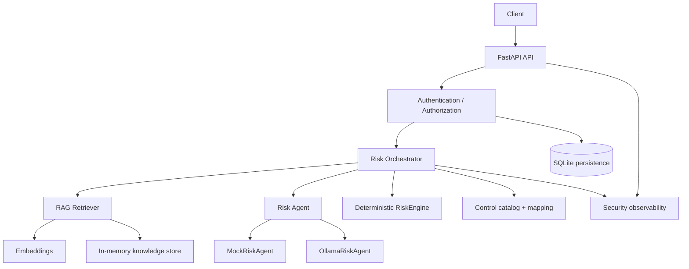

# GRC Risk Assessment Agent

[](https://www.python.org/downloads/)
[](https://fastapi.tiangolo.com/)
[](https://github.com/karangoswami9332/grc-risk-assessment-agent/actions/workflows/security.yml)
[](#security-testing)
[](LICENSE)

AI-assisted **Governance, Risk, and Compliance (GRC)** risk assessment system. It combines optional local LLM reasoning and RAG retrieval with **deterministic risk scoring**, an **authoritative control catalog**, control-ID validation, JWT authentication/authorization, multi-tenant isolation, structured security audit logging, and a dedicated offline security test suite.

Describe a security scenario in plain language. The API returns structured assets, threats, vulnerabilities, and risks — with likelihood/impact proposed by the agent, but **`risk_score` / `risk_rating` owned only by Python**, and mapped controls accepted only after catalog + RAG-candidate validation.

This is a **local-first portfolio / learning prototype**, not a complete enterprise GRC platform and not enterprise OIDC identity management.

---

## Why I Built This

Security and GRC teams often need a fast first-pass assessment from an unstructured scenario (for example, excessive cloud admin privileges). Spreadsheets and ad-hoc notes do not enforce consistent scoring. Raw LLM answers invent risk scores and control IDs.

Given a scenario, this system helps identify:

- assets
- threats
- vulnerabilities
- risks
- risk likelihood and impact (proposed)
- risk treatment (when proposed)
- applicable security controls (validated)

**The LLM is not trusted with compliance-critical decisions by itself.** Scoring, control identity/names, and access boundaries stay in deterministic application code.

---

## Key Design Principle

| Concern | Owner |
| --- | --- |
| Narrative / structured proposal | LLM (or mock agent) |
| Grounding context | RAG (advisory) |
| What is allowed into the result | Schema + control-ID validation |
| `risk_score` / `risk_rating` | **RiskEngine** |
| Control ID + display name | **Control catalog** |
| Who can read/write which assessments | **Authorization + tenant isolation** |

```text
Scenario
   ↓
RAG Retrieval (optional)
   ↓
LLM / Mock Risk Proposal
   ↓
Schema Validation (Pydantic)
   ↓
Control ID Validation (catalog ∩ RAG candidates)
   ↓
Deterministic RiskEngine (likelihood × impact)
   ↓
Tenant / Authorization Checks (API)
   ↓
Audited API Response
```

Probabilistic AI reasoning is intentionally separated from security-critical logic.

---

## Architecture



Packages under `src/grc_agent/`:

| Package | Role |
| --- | --- |
| `api/` | FastAPI app, routes, schemas, assessment service, correlation middleware |
| `orchestrator/` | Scenario → retrieve → propose → score → map controls |
| `agents/` | `RiskAgent` interface; `MockRiskAgent` and `OllamaRiskAgent` |
| `rag/` | Chunking, embeddings, in-memory store, retrieval, startup wiring |
| `controls/` | Authoritative catalog load + control-ID / mapping validation |
| `engine/` | Fixed 5×5 matrix and `RiskEngine` |
| `llm/` | Local Ollama HTTP client |
| `auth/` | JWT validation, roles, FastAPI authz dependencies, tenant policies |
| `observability/` | `X-Request-ID`, structured audit events, in-process counters |
| `db/` | SQLAlchemy / SQLite models, repository, non-destructive ownership migration |
| `models/` | Domain enums and entities |
| `config.py` | Environment settings + production auth fail-closed validation |

**Not present:** Kubernetes, Redis, Kafka, OpenTelemetry exporters, Prometheus/Grafana, cloud CSP APIs, or an external IdP.

### RAG (optional)

Runs only when **both** `GRC_RISK_AGENT=ollama` and `GRC_RAG_ENABLED=true`:

1. Ingest markdown under `data/knowledge/` (`*.md`, non-recursive)
2. Control-aware chunking for `controls.md`; general chunking for other docs
3. Embed with local Ollama `nomic-embed-text` (fake embedder in tests)
4. Store vectors **in process** (cosine similarity; no FAISS/Chroma)
5. Retrieve top **5** chunks (`DEFAULT_TOP_K`) as advisory LLM context
6. Extract candidate control IDs from that context for mapping gates

### RiskEngine

- Inputs: likelihood and impact on a **1–5** scale
- Score: **`likelihood × impact`** (1–25)
- Ratings: `low` 1–4 · `medium` 5–9 · `high` 10–16 · `critical` 17–25

### Control catalog

Authoritative source: [`data/knowledge/controls.md`](data/knowledge/controls.md) (10 `CTRL-*` entries). Catalog names are never taken from free-form LLM text.

Mapping requires each ID to be in the **catalog** and in **retrieved RAG candidates**. Failed IDs are dropped; the assessment still succeeds.

---

## Why This Is More Than an LLM Wrapper

The LLM (when used) is one step in an **orchestrated decision workflow**:

1. Receive a security scenario (`POST /risk-assessments` or persisted CRUD graph).
2. Optionally retrieve relevant knowledge (RAG).
3. Build advisory context for the risk agent.
4. Generate a structured `RiskProposal` (Pydantic; score fields forbidden).
5. Validate proposed control IDs against catalog ∩ candidates.
6. Resolve display names from the authoritative catalog.
7. Calculate inherent risk with `RiskEngine`.
8. Apply treatment fields when present on the proposal / create payloads.
9. Persist assessments and children in SQLite where using the CRUD API (`POST /risk-assessments` itself is **not** persisted).
10. Emit security/audit telemetry (correlation ID + structured events).

There is **no** autonomous remediation, ticketing, or continuous monitoring.

---

## Security Architecture

### Authentication

- Bearer JWT via **PyJWT**
- Configured algorithm only (header `alg` must match; `alg=none` rejected)
- Signature, expiry (`exp`), and optional issuer/audience verification
- HS* uses `JWT_SECRET` only; RS*/ES* uses `JWT_PUBLIC_KEY` only (no algorithm-confusion key mixing)
- Production (`GRC_APP_ENV=production`) **fail-closed**: auth required; issuer/audience required; validated in `assert_auth_configuration()` for both `get_settings()` and `create_app(Settings(...))`
- Development/test may set `AUTH_ENABLED=false` (local admin principal)

**This is a local/test JWT authentication layer — not enterprise OIDC/IdP integration** (no login UI, JWKS polling, refresh tokens, or managed directory).

### Authorization

Roles that exist: **`admin`**, **`assessor`**, **`viewer`**.

| Endpoint class | admin | assessor | viewer |
| --- | --- | --- | --- |
| `POST /assessments` and nested writes | allowed | allowed | **403** |
| `GET /assessments`, `GET …/{id}`, `GET …/risks` | allowed | allowed* | allowed* |
| `POST /risk-assessments` | allowed | allowed | **403** |

\*Non-admin access is **tenant-scoped**. Cross-tenant → **404**. Admin may cross tenants. Missing/invalid auth → **401**.

(`require_risk_assessor` is a FastAPI dependency alias for admin+assessor on the orchestrator route — not a fourth role.)

### Tenant isolation

- `tenant_id` and `owner_subject` come from the authenticated principal on create
- Clients cannot supply those fields (`AssessmentCreate` uses `extra="forbid"`)
- List/get/nested reads and writes are tenant-scoped for non-admins
- Cross-tenant discovery is reduced by returning **404**

### Security observability

- `X-Request-ID` / correlation IDs
- Structured audit events (metadata only), including:
  - `authentication_failed`, `authentication_succeeded`, `authorization_denied`
  - `assessment_started`, `rag_retrieval_completed`, `llm_proposal_generated`
  - `control_mapping_completed`, `invalid_control_id_rejected`, `risk_scored`
  - `assessment_completed`, `assessment_failed`
- Sensitive keys (tokens, secrets, Authorization headers, full claims payloads, etc.) are stripped from audit fields
- Full prompts, full LLM responses, and full scenario text are not logged as audit content

### Database migration safety

Fresh DBs get `tenant_id` / `owner_subject` via `create_all`. Existing pre-auth SQLite DBs are upgraded with **non-destructive** `ALTER TABLE … ADD COLUMN` (defaults `'local'` for existing rows). No DROP / data wipe. Migration is idempotent on restart.

---

## Threat Model

| Threat | Example | Mitigation |
| --- | --- | --- |
| Prompt injection | Scenario tries to force control selection | Schema + catalog ∩ RAG candidate validation |
| Control hallucination | Invented `CTRL-999` | Control ID validation |
| Control name spoofing | Fake control name in LLM text | Catalog-authoritative names |
| Risk score manipulation | Client/LLM supplies `risk_score` | Forbidden on schemas; RiskEngine owns scoring |
| RAG poisoning | Retrieved text pushes invalid IDs | Candidate validation still required |
| JWT tampering | Modified role/tenant/subject | Signature verification + claim checks |
| Algorithm confusion | HS under RS config | Configured alg + separated key material |
| Tenant IDOR | Access another tenant’s assessment | Tenant-scoped queries / 404 |
| Ownership spoofing | Body `tenant_id` / `owner_subject` | Server-derived ownership; 422 on extra fields |
| Secret leakage | Token in logs/errors | Audit filtering + generic 401/403 bodies |

---

## Continuous Security Validation

GitHub Actions (`.github/workflows/security.yml`) runs automatically on pushes and pull requests to `main`:

- full `pytest` regression suite (offline mock agent — no Ollama required)
- dedicated `tests/security` suite (authn/authz, tenant isolation, prompt injection, control validation, audit hygiene, …)
- Bandit static analysis on `src/`
- `pip-audit` against **application** dependencies declared in `pyproject.toml` (not the entire global environment)
- basic repository hygiene (conflict markers / `git diff --check` on the commit range)

CI uses `permissions: contents: read` only. It does not require cloud credentials, API keys, or JWT secrets.

## Security Testing

Verified collection counts in this repository:

| Suite | Count |
| --- | --- |
| Full `pytest` | **345** |
| `tests/security` | **132** |
| Bandit (`bandit -r src/`) | **0 findings** (as of last local run) |

Coverage includes (among others): prompt injection, hallucinated control IDs, RAG candidate constraints, control-name spoofing, score smuggling, malformed LLM output, API error hygiene, secret-leakage checks, authn/authz/JWT attacks, tenant isolation / IDOR, ownership spoofing, production auth fail-closed, schema ownership migration, audit/correlation-ID behavior.

```bash
pytest
pytest tests/security -v --tb=short
bandit -r src/ -f txt
```

Optional dependency scan (not a CI gate in this repo): `pip-audit`. Recent local scans reported **no PyJWT / FastAPI / pydantic / SQLAlchemy / uvicorn advisories**; **pip** itself may show tooling advisories — upgrade pip when convenient.

---

## Example

Scenario used throughout development:

> A cloud administrator has excessive permissions and can access systems and sensitive data that are not required for their job responsibilities.

### Mock agent (default, offline)

Likelihood/impact are fixed (`4` × `5` → score **20**, rating `critical`). `mapped_controls` is empty because the mock agent does not select catalog IDs.

```bash
curl -X POST http://127.0.0.1:8000/risk-assessments ^
  -H "Content-Type: application/json" ^
  -d "{\"scenario\": \"A cloud administrator has excessive permissions and can access systems and sensitive data that are not required for their job responsibilities.\"}"
```

### Ollama + RAG path (illustrative)

When Ollama and RAG are enabled, the agent may propose likelihood/impact and `selected_control_ids`. Only IDs that pass **catalog ∩ retrieved candidates** appear in `mapped_controls`, with **catalog names**. Example shape after validation (fields abbreviated):

```json
{
  "scenario": "A cloud administrator has excessive permissions and can access systems and sensitive data that are not required for their job responsibilities.",
  "risk_score": 25,
  "risk_rating": "critical",
  "scored_risks": [
    {
      "likelihood": 5,
      "impact": 5,
      "risk_score": 25,
      "risk_rating": "critical"
    }
  ],
  "mapped_controls": [
    {
      "control_id": "CTRL-CLD-002",
      "name": "Review Cloud IAM Configurations"
    },
    {
      "control_id": "CTRL-AC-001",
      "name": "Enforce Least Privilege Access"
    }
  ]
}
```

Important security behavior:

- The LLM may **propose** controls; only validated catalog/RAG survivors remain.
- Score **25** is `5 × 5` from **RiskEngine**, not a trusted LLM field.

---

## API

Implemented routes (see `src/grc_agent/api/routes.py`). When `AUTH_ENABLED=false` (development/test default), a local admin principal is used. When auth is enabled, send `Authorization: Bearer <JWT>`.

| Method | Path | Auth roles | Purpose |
| --- | --- | --- | --- |
| `POST` | `/risk-assessments` | admin, assessor | Orchestrated assessment (**not persisted**) |
| `POST` | `/assessments` | admin, assessor | Create persisted assessment (+ optional children) |
| `GET` | `/assessments` | admin, assessor, viewer | List assessments (tenant-scoped except admin) |
| `GET` | `/assessments/{id}` | admin, assessor, viewer | Get assessment graph |
| `POST` | `/assessments/{id}/assets` | admin, assessor | Add asset |
| `POST` | `/assessments/{id}/threats` | admin, assessor | Add threat |
| `POST` | `/assessments/{id}/vulnerabilities` | admin, assessor | Add vulnerability |
| `POST` | `/assessments/{id}/controls` | admin, assessor | Add control |
| `POST` | `/assessments/{id}/risks` | admin, assessor | Add risk (**RiskEngine scores**) |
| `GET` | `/assessments/{id}/risks` | admin, assessor, viewer | List risks |

Unknown IDs → **404**. Invalid bodies / forbidden score fields → **422**.

Docs while running: [http://127.0.0.1:8000/docs](http://127.0.0.1:8000/docs)

Minimal orchestrator request:

```json
{ "scenario": "A cloud administrator has excessive permissions…" }
```

---

## Running Locally

**Requirements:** Python **3.11+**. Optional: [Ollama](https://ollama.com/) with `llama3.1:8b` and `nomic-embed-text`.

```bash
python -m venv .venv

# Windows
.venv\Scripts\activate

# macOS / Linux
# source .venv/bin/activate

pip install -e ".[dev]"
```

Copy [`.env.example`](.env.example) to `.env` for local overrides. **Never commit secrets.**

### Configuration (summary)

| Variable | Default | Meaning |
| --- | --- | --- |
| `GRC_DATABASE_URL` | `sqlite:///data/grc_agent.db` | SQLite URL |
| `GRC_RISK_AGENT` | `mock` | `mock` or `ollama` |
| `OLLAMA_HOST` | `http://127.0.0.1:11434` | Ollama base URL |
| `OLLAMA_MODEL` | `llama3.1:8b` | Chat model |
| `OLLAMA_EMBED_MODEL` | `nomic-embed-text` | Embedding model |
| `OLLAMA_TIMEOUT_SECONDS` | `180` | Chat timeout |
| `GRC_RAG_ENABLED` | `false` | RAG (requires `ollama`) |
| `GRC_RAG_DEBUG` | `false` | Print retrieved context before propose |
| `GRC_APP_ENV` | `development` | `development` \| `test` \| `production` |
| `AUTH_ENABLED` | `false` | Require JWT; **must be true in production** |
| `JWT_ALGORITHM` | `HS256` | HS* → secret; RS*/ES* → public key |
| `JWT_ISSUER` / `JWT_AUDIENCE` | empty | Verified when set; **required in production** |
| `JWT_SECRET` / `JWT_PUBLIC_KEY` | empty | Key material — never commit real values |

### Mock mode (default)

```bash
uvicorn grc_agent.api.app:create_app --factory --reload
```

### Ollama without RAG

```bash
# Windows PowerShell
$env:GRC_RISK_AGENT="ollama"
uvicorn grc_agent.api.app:create_app --factory --reload
```

### Ollama with RAG

```bash
$env:GRC_RISK_AGENT="ollama"
$env:GRC_RAG_ENABLED="true"
uvicorn grc_agent.api.app:create_app --factory --reload
```

### Auth enabled (local JWT)

```bash
$env:GRC_APP_ENV="development"
$env:AUTH_ENABLED="true"
$env:JWT_ALGORITHM="HS256"
$env:JWT_ISSUER="grc-agent-local"
$env:JWT_AUDIENCE="grc-agent-api"
$env:JWT_SECRET="replace-with-a-long-random-local-secret"
uvicorn grc_agent.api.app:create_app --factory --reload
```

### Tests and Bandit

```bash
pytest
pytest tests/security -v --tb=short
bandit -r src/ -f txt
```

---

## Security Engineering Decisions

1. **Deterministic RiskEngine** — scores stay auditable and model-independent.
2. **Authoritative control catalog** — IDs and names are not LLM memory.
3. **RAG as advisory context** — retrieval helps prompting; validation still gates mappings.
4. **Production auth fail-closed** — `assert_auth_configuration` blocks unauthenticated / incomplete production settings at load and `create_app`.
5. **Server-derived tenant ownership** — never trust body `tenant_id` / `owner_subject`.
6. **Cross-tenant 404** — reduces resource enumeration versus revealing “forbidden but exists”.
7. **Metadata-only security logs** — no tokens, secrets, or full prompt/response dumps.
8. **Non-destructive ownership migration** — existing SQLite rows keep data; defaults `'local'`.
9. **MockRiskAgent** — deterministic offline CI and demos without Ollama.
10. **`tests/security/`** — abuse cases isolated from happy-path unit/API tests.

---

## Limitations / Roadmap

**Not implemented** (do not assume these exist):

- Enterprise OIDC / JWKS / IdP login
- Refresh-token / session management
- Persistent vector database
- Distributed observability (OpenTelemetry, Prometheus, Grafana, log shipping)
- Cloud posture integrations (AWS/Azure/GCP APIs)
- Continuous monitoring / alerting
- Automated remediation or ticketing
- Multi-framework mapping UI (ISO 27001 / NIST CSF / CIS products)
- Production deployment architecture (containers/k8s as a shipped product)
- Web dashboard / PDF reporting
- Evidence upload / control effectiveness automation

Possible directions: richer catalogs, proposal evaluation harnesses, optional packaging — **without** moving scoring or catalog authority into the LLM.

---

## Interview Talking Points

- **Why not trust the LLM with risk scoring?** GRC scores must be reproducible; the model proposes likelihood/impact, `RiskEngine` computes `likelihood × impact` and rating bands.
- **Why RAG?** Ground control selection in ingested catalog/knowledge text instead of parametric hallucination alone; still advisory until validated.
- **How do you prevent hallucinated controls?** Accept IDs only if present in the catalog **and** retrieved candidates; names always from the catalog.
- **How do you handle prompt injection?** Treat scenario/LLM/RAG text as untrusted; enforce schemas and mapping gates; reject score fields on requests.
- **How is tenant isolation enforced?** Principal supplies tenant; repository/service scope lists and reads; cross-tenant → 404; admin is explicit.
- **How does production fail closed?** `GRC_APP_ENV=production` requires auth + issuer/audience (+ key material); validated for env-loaded **and** manually constructed `Settings`.
- **How did you test authentication?** Dedicated security tests for missing/malformed tokens, expiry, iss/aud, `alg=none`, forged claims, alg confusion, logging hygiene.
- **How did you test IDOR?** Tenant A creates; tenant B get/list/modify/nested risks → 404; spoofed ownership fields → 422.
- **What does observability capture?** Correlation IDs and structured metadata events — not Authorization headers, JWTs, or full prompts/responses.
- **What would you change for production?** Wire a real OIDC/JWKS IdP, managed secrets, persistent vectors, and shipped telemetry — keep RiskEngine/catalog gates.
- **Why a mock agent?** Deterministic tests and demos without network/LLM flakiness while preserving the same orchestrator contracts.
- **Why is this an agent, not a chatbot?** Orchestrated retrieve → propose → validate → score → authorize → audit workflow; the LLM is a component, not the application.

---

## License

MIT. See [LICENSE](LICENSE).
